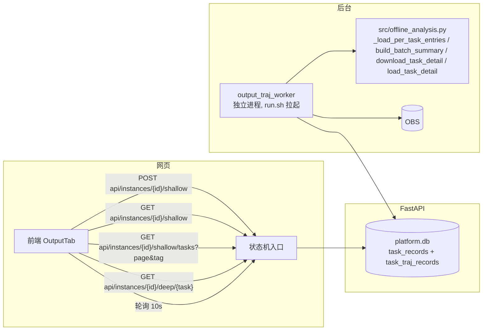

# 批跑作业「输出」页改造方案

> 目标页面：实例详情页 Tab 3「输出」。
> 把当前 OBS 文件树浏览改成「漏斗柱状图 + 会话列表 + 会话详情弹窗」，数据落 `platform.db`（`task_records` + 新增轨迹级表）状态机。

## 一、现状与目标差异

| 项 | 现在 | 目标 |
|---|---|---|
| 数据源 | `traj-stats`（OBS 在线拉取，每次刷新重新下 tsr）| `platform.db`（`task_records` 分级回填 + 轨迹级明细表），worker 后台分级 |
| 列表形态 | 柱状图 + 文件树（OBS 浏览）| 柱状图 + **会话表格**（20 行/页）|
| 会话行 | 无 | Session 名称（可点击）/ 标签 / 评测 / Completion / Task-DONE / 工具失败 |
| 详情 | 文件树点文件预览 | 点击 Session 弹窗：Session-ID、评测结果、完成分数、查看具体轨迹 |
| 轨迹查看 | 无 | 弹窗内 tab：「Assistant轨迹」「Evaluator轨迹」「任务Log」|
| 刷新机制 | 手动点「全量刷新」| 页面定时探活 + 手动刷新，均触发 worker 重跑 |

## 二、架构：状态机 + 复用现有离线引擎



**核心思路：把「浅层分析」「深层下载」从 CLI 脚本改成受控状态机，Worker 独立进程后台消费，网页只管轮询状态。**

### 0. 数据源：复用 platform.db，不另起 hive_output.db

`platform.db` 已有任务事实表 `task_records`（`task_idx / config_name / status / error_code / error_category / eval_score / eval_completion / gate`），
且建表时已预留 `traj_level` 列（"未来 L0/L1/L1.5/L2/L3"）—— 轨迹分级就是它的既定落点。若另起 `hive_output.db` 平行库，
同一份 tsr 数据会分别写进 task_records 与新库（双写双算，必然不一致）。

**定论：不再建 `hive_output.db`。** 新增的轨迹级明细表 `task_traj_records` 直接建在 platform.db（见 §三-迁移），
漏斗聚合（L0–L3 柱状图）不落表、由接口 SQL 现场聚合。

### 1. 任务粒度 = task_instances（实例），不是单个会话

- 任务全集已在 `task_records`，不用 obsutil ls 枚举；worker 按 `task_records` 的任务逐个做轨迹分级
- 漏斗柱状图 = `COUNT/GROUP BY level FROM task_traj_records`，会话表格 = `task_traj_records` 行（每会话 level/completion/task_done）
- 实例级只存 `traj_level`（任务级分类），轨迹级明细存 `task_traj_records`


### 2. 状态机（`task_records.traj_level` + `task_traj_records` 标记位）

```
浅层:   traj_level IS NULL → running → 回填 traj_level | failed
深层:   task_traj_records.status → pending → downloading → done | failed
```

- 浅层用 `task_records.traj_level` 是否为空当队列：页面 POST /shallow → 置 NULL → worker 消费 → 回填 L 标签
- **stale**：worker 定期（如 10min）把 `updated_at` 超过阈值的 `traj_level` 置回 NULL（运行中的批次持续产出，自动重跑）
- 深层无完成时间概念（下载完即 done），和浅层区分：**深层用 `task_traj_records.status` 列**（pending/downloading/done/failed），同一任务多个会话可并行下载

### 3. 深层下载命中现有缓存

`download_task_detail` 下载到 `OUTPUT_CACHE/<batch>/<task>/`，`task_traj_records` 有回填列（`assistant_traj_path`/`evaluator_traj_path`/`task_log_path`/`gateway_log_path`/`eval_log_path`），下载完成把本地路径回填进去，详情接口直接读本地。**同任务重复下载靠「本地已存在 + mtime 新鲜」跳过**，不重复拉 OBS。

## 三、改动清单

### 后端（`platform/`）

| 文件 | 改动 |
|---|---|
| `api/core/database.py` | `init_db()` 加 `task_traj_records` DDL（见下） |
| **新增** `offline/output_worker.py` | **独立进程**常驻 worker：浅层按 `task_records` 任务分级（`_load_per_task_entries` 快路径 / `build_batch_summary` tsr 陈旧兜底）→ 回填 `task_records.traj_level` + upsert `task_traj_records`；深层消费 `task_traj_records` 待下载标记（`download_task_detail` + 回填 5 路径列） |
| **新增** `api/routers/batch_output.py` | 路由：`POST /{id}/shallow`（触发浅层）、`GET /{id}/shallow`（查状态+漏斗）、`GET /{id}/shallow/tasks`（分页列表+标签过滤）、`GET /{id}/deep/{task}`（触发深层）、`GET /{id}/deep/{task}/status`（查深层状态）、`GET /{id}/deep/{task}/detail`（详情） |
| `main.py` | 只挂载新 router；**不起 worker 协程**（worker 是独立进程） |
| `run.sh` | 生产 `start/restart` 拉起 `offline/output_worker.py`（写 `platform/worker.pid`），`stop` 按 pid 停；dev 模式不自动起 |
| `output_db.py` / `output_pipeline.py` | **不动**（保留手动调试价值，新链路不引用） |

### 前端（`frontend/src/views/InstanceDetail.vue` + 新组件）

| 文件 | 改动 |
|---|---|
| `InstanceDetail.vue` | 输出 tab 改为「评估统计」卡片（复用）+ **会话表格**（替换文件树）；会话表格/详情弹窗/轨迹查看/Log 面板以「函数 + 计算属性」收敛进本文件（§五-0），不新增独立组件文件 |

### 数据库迁移

```sql
-- 轨迹级明细表（platform.db 内新增；task_records 只回填 traj_level，不重复存轨迹级数据）
CREATE TABLE IF NOT EXISTS task_traj_records (
    id INTEGER PRIMARY KEY AUTOINCREMENT,
    instance_id TEXT NOT NULL,        -- 对应 task_instances.id
    task_idx INTEGER,                 -- 对齐 task_records 键（可空，config stem 对齐用）
    config_name TEXT NOT NULL,        -- 对齐 task_records.config_name
    traj_name TEXT NOT NULL,          -- 会话名（agent 目录 / session stem）
    level TEXT NOT NULL,              -- L0/L1/L1.5/L2/L3（compute_level 输出，dropped 归 L0）
    harness TEXT DEFAULT 'openclaw',
    passed_gate INTEGER, has_eval INTEGER, task_done INTEGER,
    completion REAL, tool_calls INTEGER, plain_rounds INTEGER,
    input_tokens INTEGER, output_tokens INTEGER, reasoning_tokens INTEGER, total_tokens INTEGER,
    char_len INTEGER,
    trajectory_rel TEXT,              -- 轨迹相对路径（<batch>/<task>/容器相对路径）
    -- 深层下载状态与本地缓存路径（详情懒加载时回填）
    status TEXT DEFAULT 'done',       -- pending/downloading/done/failed（仅深层触发时置 pending）
    error TEXT,
    assistant_traj_path TEXT, evaluator_traj_path TEXT,
    task_log_path TEXT, gateway_log_path TEXT, eval_log_path TEXT,
    updated_at TIMESTAMP DEFAULT CURRENT_TIMESTAMP,
    UNIQUE(instance_id, config_name, traj_name)
);
CREATE INDEX IF NOT EXISTS idx_traj_records_inst ON task_traj_records(instance_id);
CREATE INDEX IF NOT EXISTS idx_traj_records_task ON task_traj_records(instance_id, config_name);
```

## 四、页面交互时序

### 浅层流程

```
用户点「输出」tab
→ 前端 onMounted 调 POST /shallow（首次）→ 返回 status=pending
→ 每 10s GET /shallow
    - pending/running：页面显示「分析中…」进度
    - done：拉 GET /shallow/tasks → 渲染表格 + 柱状图
→ 手动点「刷新」→ POST /shallow（置 pending）→ worker 重跑
→ worker 每 10min 将 done 超过阈值的任务置回 pending（自动刷新）
```

### 深层流程

```
用户点某会话名称
→ 弹窗先显示「下载中…」
→ 前端 POST /deep/{traj_name}（置 pending）
→ 每 3s GET /deep/{traj_name}/status
    - downloading：显示进度（"正在下载轨迹文件…"）
    - done：GET /deep/{traj_name}/detail → 渲染详情
    - failed：显示错误
```

## 五、UI 风格基准：data_viewer 可复用元素

> 参考实现：`/root/traj_output/data_viewer/`（server.py + static/index.html，单体 Vue3+Element Plus 深色看板）。
> 它实现了与本方案高度重合的「任务列表 → 会话表格 → 会话详情 → 轨迹/Log 查看」链路。
> 复用规则：**纯展示元素（表格列/弹窗/轨迹渲染/Log）直接移植**；**交互状态机（触发/轮询/写回）按本方案 §四 的语义重写**（data_viewer 是自管队列，本方案由独立 worker 进程驱动）。

### 0. 前端代码形态

**不新增独立组件文件**，全部以「函数 + 计算属性」收敛进 `InstanceDetail.vue`（沿用该文件现有单文件组织，不引第三方）：

- 展示元素 → 模板内 `<el-table>` / `<el-dialog>` / `<el-tabs>` 区块（对应 data_viewer 三个组件的渲染段）
- 数据装载 → `loadShallowStats()` / `loadSessionRows()` / `openSessionDetail()` / `loadTrajectory(tab)` 等函数，轮询走 `setInterval` + `onUnmounted` 清理（与现有 `loadTrajStats`/`pollTaskStatus` 同款）
- 分级标签样式 → 放 InstanceDetail.vue 的 `<style>`（`level-tag-*` 类），**不放全局**；复用现有状态色板（`#10b981` 绿 / `#f56c6c` 红 / `#e6a23c` 橙 / `#6366f1` 靛蓝），data_viewer 的 neon 配色仅作参考不整套引入

### 1. 会话表格

data_viewer 任务详情页表格与本方案 `GET /shallow/tasks` 返回列一一对应：

| 本方案列 | 数据来源 | 展示（复用 data_viewer） |
|---|---|---|
| 会话（可点击）| `task_traj_records.traj_name` | 表格行点击 → 打开详情弹窗（替代 :428 `openDetail`）|
| 标签（L0/L1/L1.5/L2/L3 + TASK_DONE）| `level` + `task_done` | 彩色 el-tag（L0=info / L1=primary / L1.5=warning / L2=danger / L3=紫 `#722ed1`）+ 绿 TASK_DONE tag（:429-438）|
| 评测 | `has_eval` | `有/无` el-tag（success/info）（:439-443）|
| Completion | `completion` | **内嵌进度条**（`comp-bar` + `comp-fill` + 数值；≥1 红 / ≥0.5 琥珀 / 其他紫 / null 灰）（:444-454）|
| Task-DONE | `task_done` | `是/否` el-tag（:455-460）|
| 工具失败 | `task_traj_records` 惰性字段（§五-5）| `失败数/调用数` + 失败率，hover tooltip 给口径（:461-471）|
| Eval-OC-Trace | `eval_qc`（预留）| 纯文本列（`show-overflow-tooltip`）（:472）|

- **标签过滤**：`level_filter` 多选下拉（L0/L1/L1.5/L2/L3/TASK_DONE，`collapse-tags`），后端同参数字段逗号分隔（server.py:1142-1182），与 completion 过滤可组合
- **分页**：`el-pagination`（`total, prev, pager, next`），每页 10/20/50 可切，默认 20 —— 满足 sketch「每页最多 20」
- **行级视觉编码**：completion=1 整行淡红、≥0.5 淡琥珀（:1618 `rowClass`），扫行即知质量

### 2. 会话详情弹窗

90vw 大弹窗（`destroy-on-close`，体高 80vh 内滚动）：

- `el-descriptions` 摘要区：Session ID（等宽青色）、评测结果 tag、**Completion 用 `el-progress` 大进度条**（比纯数字直观）
- 「查看具体轨迹」按钮 → 加载后切到 **Assistant 轨迹 / Evaluator 轨迹 / 任务 Log** 三个 tab
- **默认落「任务 Log」tab 秒开**，Assistant 轨迹点击后才加载（`trajTab='log'`）——避免每次打开弹窗都拉大文件
- Evaluator 侧按需懒加载：点击 tab 才拉，不随详情预载
- 失败降级：找不到 evaluator 时 tab 置灰显示「（未找到）」，不影响其余展示
- 打开流程按 §四-深层：POST /deep/{traj_name} → 3s 轮询 status → done 后 GET /deep/{traj_name}/detail 渲染

### 3. 轨迹查看器

消息流渲染：本方案 `src/offline_analysis.parse_openclaw_trajectory` 产出 blocks（后端已有），前端仅补渲染（data_viewer :739-787 全量照抄）：

- 消息按 role 着色：SYSTEM 灰 / USER 青 / ASSISTANT 紫 / TOOL+RESULT 绿（CSS `role-*` 类，:106-119）
- 每条消息**默认折叠**（点 role 头展开，caret ▶/▼），顶部「全部折叠/全部展开」；折叠状态 key = `tab:index`，切 tab 不丢
- 长文本（>600 字）显示前 600 字 + 「…展开看全文」，逐条记录展开态（:1599-1608）
- toolResult 头显示工具名 + **失败徽标**：`✗ 失败 · exit N` / `exit 0`（:754-759）——与「工具失败」列同口径可复用
- 后端只回传裁剪后的消息结构（`_MAX_MSG_CHARS=200KB` 截断，server.py:386），前端永不收到 >200KB 单条消息
- **数据源是本地缓存**：详情接口读 `assistant_traj_path`/`evaluator_traj_path`（§二-3 回填列），不现场拉 OBS

### 4. 任务 Log 面板（「任务Log」tab）

- log 自动加载（秒开）、只回传尾部 `_LOG_MAX_BYTES=2MB`，meta 栏标注「文件名 · 大小 KB · 日志过大仅显示尾部」
- **裁决面板置顶**：从日志解析出的 completion/rubric 逐条核验（gate 在前，`_sort_rubric_gate_first`）渲染成绿色卡片组，未通过项标红 —— 比纯文本 log 更有信息量
- 本地路径 `task_log_path`/`gateway_log_path`/`eval_log_path` 已回填时直接读缓存；未回填先触发深层下载


### 5. 惰性「工具失败」统计交互（后端 + 前端）

data_viewer 把它做成**按需任务而非浅层快路径字段**：点「统计工具失败」→ POST 触发后台下载全量 assistant 轨迹（include `agents/assistant*/sessions/*.jsonl` + `logs/trajectories/*query*.json`，exclude `*.trajectory.jsonl`，analyze_tool_failures.py:29-34）→ 轮询 status（2s）→ 完成写回 + 静默刷新表格（:1293-1340）。统计口径（traj_stats.py）：
- openclaw：`count_tool_failures_openclaw`（:463）toolCall 部件数 + toolResult `isError/exitCode≠0`
- Hermes：`count_tool_failures_query1`（:497）turns[].tool_calls 的 output JSON `ok=false/error/exit_code≠0`

→ 与本方案深层队列同构：工具失败统计就是深层下载的孪生任务，挂同一 worker（`task_traj_records` 加 `tool_failures`/`tool_calls_total` 列，统计完回填）。

### 6. 不采用：OBS 文件树
      
data_viewer 无文件树，纯表格驱动。**结论：本方案 Tab3 不保留文件树**；若仍需浏览原始文件，可降级为详情弹窗内的次要入口（如「原始路径」链接跳 OBS 控制台）。

## 六、决策点（结合基准后更新）

1. **Worker 运行形态**：独立进程（`offline/output_worker.py`，`run.sh` 拉起，`worker.pid` 管理），**不随 platform 协程**——任务多时避免卡住请求事件循环；`run.sh start` 是 `--workers 4` 多进程，协程会变多份，独立进程天然单例
2. **「工具失败」列**：**已由基准解决**——不做浅层快路径字段，改为惰性深层任务（复用 `task_traj_records.status` 待下载标记，按需下载全量轨迹后计数），口径照抄 `traj_stats.count_tool_failures_*`
3. **深层详情范围**：**已由基准解决**——不整目录下载，按文件模式级粒度拉：evaluator 只拉 `*evaluator*sessions*.jsonl`、log 只拉 `logs/<task>.log` 单文件、Hermes 只拉 `*profiles/evaluator/sessions/*.json`（server.py:1577/1624/1713）；仅工具失败统计例外（全量）
4. **数据源**：**已定——复用 platform.db**，不建 hive_output.db 平行库（见 §二-0）；`task_records` 回填 `traj_level` + 新 `task_traj_records` 轨迹级明细
5. **文件树**：不保留（见五-7）

## 七、落地定稿（2026-08-21 确认）

按 §二-0 的数据源定论，落地清单：

1. `api/core/database.py`：`init_db()` 追加 `task_traj_records` DDL（§三-迁移 SQL）
2. **新增** `offline/output_worker.py`：独立进程常驻循环（`--once`/`--interval` 便于调试）
   - 浅层：取 `task_records` 中 `traj_level IS NULL` 的任务 → `_load_per_task_entries` 快路径（tsr 陈旧 → `build_batch_summary` 兜底）→ `compute_level` 打标 → 回填 `task_records.traj_level` + upsert `task_traj_records`
   - stale：定期把 `updated_at` 超阈值的 `traj_level` 置回 NULL
   - 深层：消费 `task_traj_records.status='pending'` → `download_task_detail` + `load_task_detail` → 回填 5 路径列 → done/failed
3. **新增** `api/routers/batch_output.py`：shallow/deep 六个端点，全同步（`async_execute`），只读写 platform.db，不碰 obsutil
4. `main.py`：挂载 batch_output router（不起 worker 协程）
5. `run.sh`：`start/restart` 拉起 worker、`stop` 按 pid 停
6. 前端：`InstanceDetail.vue` 输出 tab（统计卡 + 会话表格替换文件树 + 详情弹窗/轨迹查看/Log 面板，全部收敛进本文件，§五-0）——10s 浅层 / 3s 深层轮询

不动：`output_db.py`、`output_pipeline.py`（保留手动调试，新链路不引用）；`_eval_score.json`/`_traj_score.json` 在线拉取接口保持（运行中 batch 热更新价值），worker 分级后经 `_sync_task_records` 并入 task_records。